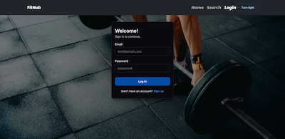
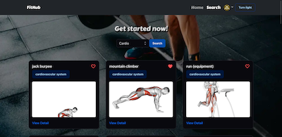
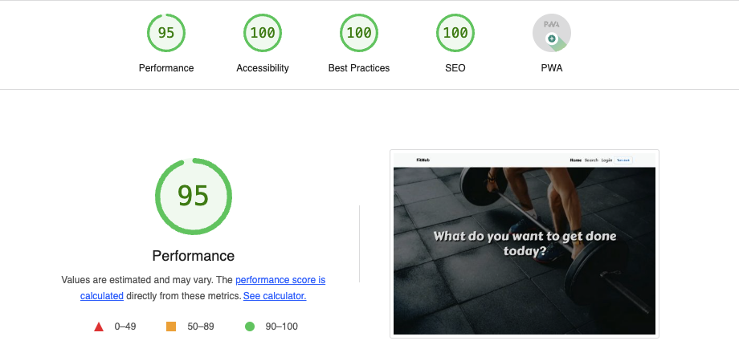

# FitHub

## Description

View deployed website: 

This project is a fitness app that allows users to find a exercise. Users can login/signup and look for exercises by different bodyparts, view the details and then save the ones they like.

## Table of Contents

- [Usage](#usage)
- [Technologies Used](#technologies-used)
- [Google lighthouse report](#google-lighthouse-report)
- [Credits](#credits)
- [License](#license)

## Usage

1. Users can search and browse workouts and click the View Detail button to see more detail.
2. To save/remove workouts, users need to Login/Signup.
3. Users can view the saved workouts from My Workout page.
4. For better user experience, there's a light/dark mode switch on the top menu.

5. Project screenshots

    

## Technologies Used

- React: Front end is built with React. React Route enables the page navigarion.
- Redux: [Redux Toolkit](https://redux-toolkit.js.org) is used to create reducers and handle async request lifecycles from [Exercise DB API](https://rapidapi.com/justin-WFnsXH_t6/api/exercisedb).
- Express
- GraphQL && Apollo
- MongoDB && Mongoose
- JWT
- IndexedDB: to save the exercise data from Exercise DB API to the client side.
- [Lazy loading image](https://developer.mozilla.org/en-US/docs/Web/Performance/Lazy_loading): Used [react-lazy-load-image-component](https://www.npmjs.com/package/react-lazy-load-image-component) to allow lazy loading images and improve web performance.
- [lossless compression](https://developer.mozilla.org/en-US/docs/Glossary/Lossless_compression): Used [compress-create-react-app](https://www.npmjs.com/package/compress-create-react-app) and [express-static-gzip](https://www.npmjs.com/package/express-static-gzip) packages to enable both [gzip](https://www.gzip.org) compression and [brotli](https://developer.mozilla.org/en-US/docs/Glossary/Brotli_compression) compression, which significantly reduced the application load time.
- This website is a PWA and meat responsive design.

## Google-lighthouse-report

- Google lighthouse report for **desktops**:
  

## Credits

- [Christopher Saechao](https://github.com/TikoMyster)
- [RuxinQu](https://github.com/RuxinQu)
- [Richard Nelson](https://github.com/nelson92)
- [Lely Huynh](https://github.com/lely2011)

## License

This project is under [MIT license](https://opensource.org/lsicenses/MIT)
